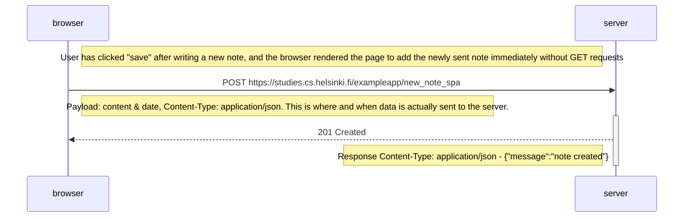

```mermaid
sequenceDiagram
    participant browser
    participant server

    Note right of browser: User has clicked "save" after writing a new note, and the browser rendered the page to add the newly sent note immediately without GET requests
    browser->>server: POST https://studies.cs.helsinki.fi/exampleapp/new_note_spa
    Note right of browser: Payload: content & date, Content-Type: application/json. This is where and when data is actually sent to the server.
    activate server
    server-->>browser: 201 Created
    Note left of server: Response Content-Type: application/json - {"message":"note created"}
    deactivate server
```
